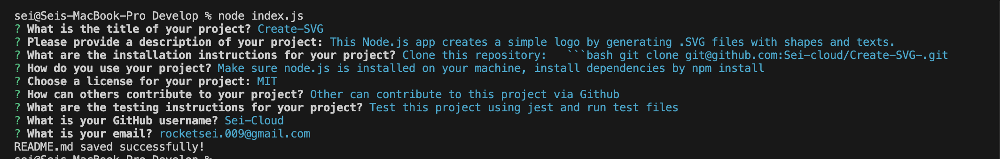

# Create-Readme---Node.js

- This app is for users to generate Readme.md file from the terminal using Node. 

## Before using it
- Make sure Node.js is installed on your machine. [Download-Node](https://nodejs.org/en/download)
- Make sure to add the inquirer package using the command "npm i inquirer@8.2.4" on the terminal.
- Make sure you're in the correct file directory when using the terminal. 

## How to use
- On the terminal use the command "node index.js".
- Then, it will ask you a series of questions such as title, description, license etc.
- After answering all the questions, it will automatically create a Readme.md file for you. 

## If you're still struggling 

Watch the video tutorial [here](https://vimeo.com/939188276?share=copy).

## Sample

Github URL: https://github.com/Sei-cloud/Create-Readme---Node.js

